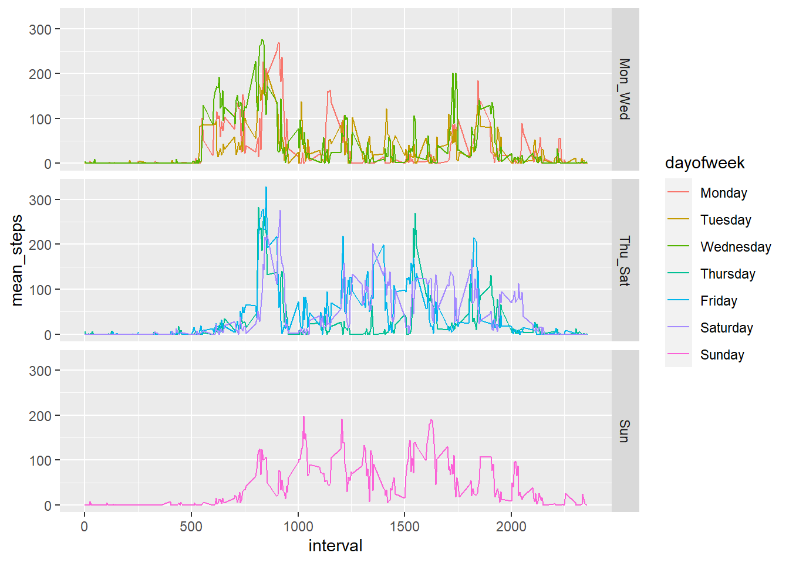

The R code requires these libraries.

```r
library(dplyr)
library(ggplot2)
library(gridExtra)
```

## Data

This assignment makes use of data from a personal activity monitoring device. This device collects data at 5 minute intervals through out the day. The data consists of two months of data from an anonymous individual collected during the months of October and November, 2012 and include the number of steps taken in 5 minute intervals each day.

Download the data set: [Activity monitoring data](https://d396qusza40orc.cloudfront.net/repdata%2Fdata%2Factivity.zip)

The following R code will download and extract the data files into the current working directory, and create the data set *activity* for analysis.


```r
url <- "https://d396qusza40orc.cloudfront.net/repdata%2Fdata%2Factivity.zip"
zipFile <- "repdata_data_activity.zip"
dataFile <- "activity.csv"
if(!file.exists(zipFile))
{
  download.file(url,destfile="repdata_data_activity.zip",method="curl")
}
if(!file.exists(dataFile))
{
  unzip(zipFile)
}
activity <- read.csv(dataFile)
```
## Objective of Analysis
To answer a set of questions relating to the activity monitoring data.

***Answers will be in italics.***

### Questions

**1. What is mean total number of steps taken per day?**

* **What are the total number of steps taken per day?**

The folliwing code creates and calls a functiont to summarise the number of steps taken per day.  The function *get_step_count* will be used to replicate these steps with modified data sets.


```r
get_step_count <- function(activity)
{
  step_count <- activity %>%
    group_by(date) %>%
    summarise(total_steps=sum(steps,na.rm=TRUE),nas=sum(is.na(steps)))
  step_count$date <- as.Date(step_count$date)
  step_count
}
step_count <- get_step_count(activity)
summary(step_count)
```

```
##       date             total_steps         nas        
##  Min.   :2012-10-01   Min.   :    0   Min.   :  0.00  
##  1st Qu.:2012-10-16   1st Qu.: 6778   1st Qu.:  0.00  
##  Median :2012-10-31   Median :10395   Median :  0.00  
##  Mean   :2012-10-31   Mean   : 9354   Mean   : 37.77  
##  3rd Qu.:2012-11-15   3rd Qu.:12811   3rd Qu.:  0.00  
##  Max.   :2012-11-30   Max.   :21194   Max.   :288.00
```
***From the summary above you can see the mean is 9,354.23 steps per day and the median is 10,395 steps per day.*
*The maximum number of steps is 21,194.***

NB: 8 of 61 days contain no activity data. 0 days contain missing data.

For this part, questions 1 to 3, we will ignore the missing values in the dataset.

The time series plot below shows the number of steps taken per day and their variation.

### Time series: Steps per day

The R code function *time_series* below generates a time series of the number of steps taken in a day. The mean steps taken during the period are shown in blue, and the median in green.


```r
time_series <- function(step_count)
{
  mean_steps_per_day <- mean(step_count$total_steps)
  median_steps_per_day <- median(step_count$total_steps)
  ggplot(step_count,aes(date,total_steps)) + geom_line() + geom_point() +
    geom_hline(yintercept = mean_steps_per_day, col="blue") +
    geom_hline(yintercept = median_steps_per_day, col = "green")
}
time_series(step_count)
```

<!-- -->

### Histogram of steps per day

The R code function *step_hist* below generates a histogram of the number of steps taken in a day. The mean steps taken during the period are shown in blue, and the median in green.


```r
step_hist <- function(sc)
{
  mean_steps_per_day <- mean(sc$total_steps)
  median_steps_per_day <- median(sc$total_steps)
  ggplot(sc,aes(total_steps)) +
    geom_histogram(bins = 20) +
    geom_vline(xintercept = mean_steps_per_day, col="blue") +
    geom_vline(xintercept = median_steps_per_day, col = "green")
}
step_hist(step_count)
```

<!-- -->


**2. What is the average daily activity pattern?**

Make a time series plot (i.e. $\color{red}{\text{type = "l"}}$) of the 5-minute interval (x-axis) and the average number of steps taken, averaged across all days (y-axis)

The R code below generates a time series across the entire period.  It converts the interval and date into a POSIXct TimeDate value so we have a meaniful x axis. The format of interval is HHMM.


```r
for (i in 1:length(activity$interval))
{
  ic <- as.character(activity$interval[i])
  len <- nchar(ic)
  seconds <- 0
  hours <- 0
  if (len < 3)
    seconds <- activity$interval[i] * 60
  else
  {
    hours <- as.integer(substring(ic, 1, len - 2))
    seconds <- as.integer(substring(ic, len - 1, len)) * 60
  }
  seconds <- seconds + hours * 60 * 60
  activity$dateTime[i] <- as.POSIXct(activity$date[i]) + seconds
}
ggplot(activity,aes(as.POSIXct(dateTime,origin="1970/01/01"),steps)) + geom_line(na.rm=TRUE) + labs(x="date")
```

<!-- -->

The r code following generates a time series plot of the mean steps for each 5 minute interval in a day over the entire data period 2012-10-01 to 2012-11-30.


```r
if(exists("interval_step_count"))
   rm(interval_step_count)
interval_step_count <- activity %>% group_by(interval) %>% summarise(total_steps=sum(steps,na.rm=TRUE),mean_steps=mean(steps,na.rm=TRUE))
#interval is in the format HHMM without leading zeros, there are 288 5 minute intervals in the day
interval_step_count$five_minute_interval <- vector("numeric",length=288)
for(i in 1:length(interval_step_count$interval))
{
  interval_step_count$five_minute_interval[i] <- (i-1) * 5
}
g <- ggplot(interval_step_count,aes(five_minute_interval/60,mean_steps)) + geom_line() + scale_x_continuous(name="Five minute Itervals", breaks=c(0:24))
#print(g)
```

**3. Which 5-minute interval, on average across all the days in the dataset, contains the maximum number of steps?**

The r code following plot the Time series above, with the addition of a red dot at the maximum number of mean steps during the day and identifies that interval.


```r
max_interval <- interval_step_count[which.max(interval_step_count$total_steps),]
g + geom_point(x=max_interval$five_minute_interval/60,y=max_interval$mean_steps,col="red")
```

<!-- -->

```r
time_str <- function(five_minute_interval)
{
  h <- trunc(five_minute_interval / 60)
  m <- five_minute_interval - (h * 60)
  sprintf("%d:%02d",h,m)
}
```

***The maximum interval shown by the red dot starts at 8:35 and has a mean of 206.2 steps taken during that 5 minute period over the entire period.***

## Imputing missing values

Note that there are a number of days/intervals where there are missing values (coded as $\color{red}{\text{NA}}$). The presence of missing days may introduce bias into some calculations or summaries of the data.

**4. Calculate and report the total number of missing values in the dataset**

***For questions 1 to 3 we found 8 of 61 days contain no activity data. 0 days contain missing data. So we choose to just ignore the missing days. The total missing data is 2,304 observations or 13.1% of the total data.*** 

Below we use only complete cases i.e. data that does not include any NAs.

The plot below shows the cases ignoring the missing data on the left and with only complete cases on the right.  Observations, are that the histogram is more meaning with complete cases, and the mean and median are now almost identical which is why only the green line for median is visible at this scale.


```r
newActivity <- activity[complete.cases(activity),]
new_step_count <- get_step_count(newActivity)
p1 <- time_series(step_count)
p2 <- step_hist(step_count)
p3 <- time_series(new_step_count)
p4 <- step_hist(new_step_count)
grid.arrange(p1, p3, p2, p4, ncol=2)
```

<!-- -->

Further analysis to devise a strategy for filling in all of the missing values in the dataset.

The r code following generates a histogram of the missing data grouped by the day of week.  That is be used to visually determine if a significant portion of data is missing.


```r
#The strategy does not need to be sophisticated. For example, you could
#use the mean/median for that day, or the mean for that 5-minute interval

activity$complete <- complete.cases(activity)
activity$dayofweek <- factor(weekdays(as.Date(activity$date)),levels=c("Monday","Tuesday","Wednesday","Thursday","Friday","Saturday","Sunday"))

ggplot(activity,aes(dayofweek)) + geom_histogram(stat="count",aes(fill=complete))
```

```
## Warning: Ignoring unknown parameters: binwidth, bins, pad
```

<!-- -->

### Daily Patterns

The r code following generates a time series of mean steps per 5 minute interval grouped by the day of week.  That is being used to visually determine if there are any trends that may be significant to missing data.


```r
daily_step_count <- activity %>% group_by(interval,dayofweek) %>% summarise(total_steps=sum(steps,na.rm=TRUE),mean_steps=mean(steps,na.rm=TRUE),median_steps=median(steps,na.rm=TRUE))
ggplot(daily_step_count,aes(interval,mean_steps)) + geom_line(aes(col=dayofweek)) + facet_grid(rows = vars(dayofweek))
```

<!-- -->

**5. Create a new dataset that is equal to the original dataset but with the missing data filled in.**

The code below uses the mean of a particular day of the week for each 5 minute interval to imputate the missing data.


```r
incomplete <- activity[!activity$complete,]
for(i in 1:nrow(incomplete))
{
  incomplete[i,]$steps <- daily_step_count[
    (daily_step_count$dayofweek==weekdays(as.Date(incomplete[i,]$date))) &
    (daily_step_count$interval == incomplete[i,]$interval),]$mean_steps
}
completeActivity <- activity
completeActivity[!activity$complete,] <- incomplete
```

Make a histogram of the total number of steps taken each day and Calculate and report the mean and median total number of steps taken per day.


```r
complete_step_count <- get_step_count(completeActivity)
p5 <- time_series(complete_step_count)
p6 <- step_hist(complete_step_count)
grid.arrange(p1, p3, p5, p2, p4, p6, ncol=3)
```

<!-- -->

***The mean is now 10,821.21 steps per day and the median is 11,015 steps per day.***
***The maximum number of steps is still 21,194.***

* **Do these values differ from the estimates from the first part of the assignment?**

The r code following creates a summary data frame of the observations in questions 1 to 3 above.


```r
comparison <- data.frame(case=c("Ignore","Complete","Imputed"),mean=c(mean(step_count$total_steps),mean(new_step_count$total_steps),mean(complete_step_count$total_steps)),median=c(median(step_count$total_steps),median(new_step_count$total_steps),median(complete_step_count$total_steps)))
print(comparison)
```

```
##       case     mean median
## 1   Ignore  9354.23  10395
## 2 Complete 10766.19  10765
## 3  Imputed 10821.21  11015
```
***Yes, there is a change in mean and median values for all three methods used.***

**6. What is the impact of imputing missing data on the estimates of the total daily number of steps?**

* ***The first method ignore, where the missing data is ignored in calculating the mean and medians and plotting the histogram of steps per day, resulted in a mean lower than the median values because of the number of zero steps introduced into the data.***

* ***The second method complete, where only the complete data is used, or the missing data is discarded, the median and mean both increased, and converged to a common estimate.***

* ***The third method imputed, where the missing data is calculated using the mean value of steps taken in each interval for the particularly day of the week that corresponded to the missing data. This showed a further slight increase in both mean and miedian. Resulting from more frequenct occurences over the period around the mean values.***


**7. Are there differences in activity patterns between weekdays and weekends?**

***When exploring the daily time series by day of week, we saw a difference in activity across all the days of the week, with some patterns visible.  Monday through Wednesday were similar, Thursday through to Saturday were simlar, and Sunday was a bit unique. Refer to [Daily Patterns](#Daily) in question 4 above.***

Below is the R code to seperate the weekdays and weekends.


```r
daily_step_count$weekend <- factor(daily_step_count$dayofweek %in% c("Saturday","Sunday"),levels=c(FALSE,TRUE),c("Weekday","Weekend"))
ggplot(daily_step_count,aes(interval,mean_steps)) + geom_line(aes(col=dayofweek)) + facet_grid(rows = vars(weekend))
```

<!-- -->

The R code below separates into the three groups of days that looked visually similar, as a comp[arison to the weekend data above.


```r
daily_step_count$group[daily_step_count$dayofweek %in% c("Monday","Tuesday","Wednesday")] <- "Mon_Wed"
```

```
## Warning: Unknown or uninitialised column: 'group'.
```

```r
daily_step_count$group[daily_step_count$dayofweek %in% c("Thursday","Friday","Saturday")] <- "Thu_Sat"
daily_step_count$group[daily_step_count$dayofweek %in% c("Sunday")] <- "Sun"
daily_step_count$group <- factor(daily_step_count$group,levels=c("Mon_Wed","Thu_Sat","Sun"))
ggplot(daily_step_count,aes(interval,mean_steps)) + geom_line(aes(col=dayofweek)) + facet_grid(rows = vars(group))
```

<!-- -->
